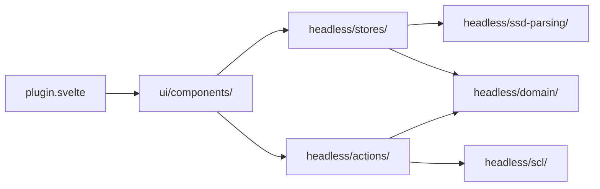

# Type Distributor

OpenSCD plugin for importing bay templates from SSD files, applying them to SCD bays, and assigning the resulting logical nodes to `S-IED` access points.

## What this plugin does

The `type-distributor` workflow has five main steps:

1. import an SSD file and parse bay types, templates, and data type templates
2. select an SCD bay and a bay type
3. validate the match and resolve ambiguous equipment manually when needed
4. apply the bay type and insert the required SCL edits
5. drag `Function` and `EqFunction` content onto `S-IED` access points

## High-level architecture

This plugin is easiest to understand as a three-layer pipeline:

1. **UI layer** in `ui/components/`
   - lets the user import an SSD, select a bay type, validate it, apply it, and drag content to `S-IED`s
2. **Headless state and logic** in `headless/`
   - stores the current working state
   - parses SSD content into an in-memory model
   - decides how bays, templates, and equipment should match
3. **SCL edit layer** in `headless/scl/`
   - turns validated user intent into concrete OpenSCD XML edits

In short: **the UI collects intent, the headless layer decides what should happen, and the SCL layer writes the actual document changes**.

### What each part is responsible for

- `plugin.svelte`
  - the custom element entry point that wires OpenSCD props into the plugin and renders the main UI
- `ui/components/`
  - the visible workflow: import, selection, validation, apply, and drag-and-drop
- `headless/stores/`
  - the reactive working state shared across the UI
- `headless/ssd-parsing/`
  - reads the imported SSD and extracts bay types, templates, and data type templates
- `headless/domain/`
  - pure business rules for matching and validation
- `headless/actions/`
  - use-case orchestration such as "validate bay type" and "apply bay type"
- `headless/scl/`
  - XML query and edit builders that create the final OpenSCD edits

## Start here

- [Source overview](docs/structure/source-overview.md) explains the current folder layout and module boundaries
- [Workflow and data flow](docs/structure/workflow-and-data-flow.md) shows how SSD import, validation, apply, and drag-and-drop fit together
- [Contributing guide](docs/contributing.md) explains the local contributor workflow for this plugin
- [ADRs](docs/adr/README.md) contain the durable architecture decisions using the Michael Nygard format

## Documentation map

### Structure

- [Source overview](docs/structure/source-overview.md)
- [Workflow and data flow](docs/structure/workflow-and-data-flow.md)

### ADRs

- [ADR index](docs/adr/README.md)

### Concepts

- [Equipment matching](docs/concepts/equipment-matching.md)
- [Assigned LNodes tracking](docs/concepts/assigned-lnodes-tracking.md)
- [Create IED and Access Point dialog](docs/concepts/create-ied-ap-dialog-form.md)

### Coding guides

- [Contributing to type-distributor](docs/contributing.md)
- [Code style](docs/code-style.md)
- [Test style](docs/test-style.md)

### How-to guides

- [Distribute types from SSD to SCD](docs/how-to/distribute-types.md)
- [Match equipment manually](docs/how-to/match-equipment.md)
