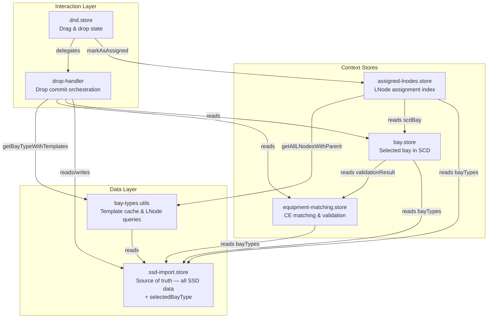

# Store Architecture

This document describes the store and utility layer in the `type-distributor` plugin — what each module owns, what it exposes, and how they relate.

## Responsibilities

| Module | Owns | Exposes |
|---|---|---|
| `ssd-import.store` | All parsed SSD data (`bayTypes`, `functionTemplates`, `conductingEquipmentTemplates`, `dataTypeTemplates`, `selectedBayType`) and the loaded document reference | `loadFromSSD()`, template lookup helpers, all `$state` properties |
| `bay-types.utils` | A lazy template cache (invalidated automatically when `bayTypes` reference changes) | `getBayTypeWithTemplates(uuid)` — assembles `BayTypeWithTemplates` with Maps; `getAllLNodesWithParent(bayTypeWithTemplates)` — pure LNode flattening |
| `bay.store` | Selected bay context in the SCD document | `selectedBay`, `scdBay` (live DOM element), `assignedBayTypeUuid`, `equipmentMatches`, `pendingBayTypeApply` |
| `equipment-matching.store` | Conducting Equipment matching state between SCD bay and bay type template | `manualMatches`, `validationResult`, `templatesByType`, `requiredTemplateCounts`, `templateCountMismatch` |
| `assigned-lnodes.store` | Index of which LNodes have been assigned to IEDs for the current bay | `rebuild()`, `isAssigned()`, `markAsAssigned()`, `areAllLNodesAssigned()`, `hasConnections` |
| `dnd.store` | Drag-and-drop UI state and drop execution | `isDragging`, `draggedItem`, `handleDragStart/End/Drop()` |
| `drop-handler` | Orchestration logic for a drop commit (not a store — plain module) | `getBayTypeApplicationState()`, `applyBayTypeIfNeeded()`, `buildEditsForIed()`, `commitEdits()` |

## Dependency Graph

## Key design decisions

- **`ssd-import.store` is the single source of truth.** All parsed SSD data — including `selectedBayType` — lives here. No other store duplicates this state.
- **`bay-types.utils` is a plain module, not a store.** Template assembly and LNode flattening require no reactive state beyond the cache. The cache is invalidated by reference comparison against `ssdImportStore.bayTypes`, which changes on every `loadFromSSD()` call.
- **No circular dependencies.** Previously `ssd-import.store` called `bayTypesStore.clearCache()`, creating a cycle. This is resolved by the self-invalidating reference check in `bay-types.utils`.
- **`dnd.store` / `drop-handler` coupling is intentional.** Drop execution inherently coordinates multiple stores (bay context, matching state, assignment index). This is modelled explicitly in `drop-handler` rather than hidden inside individual stores.
