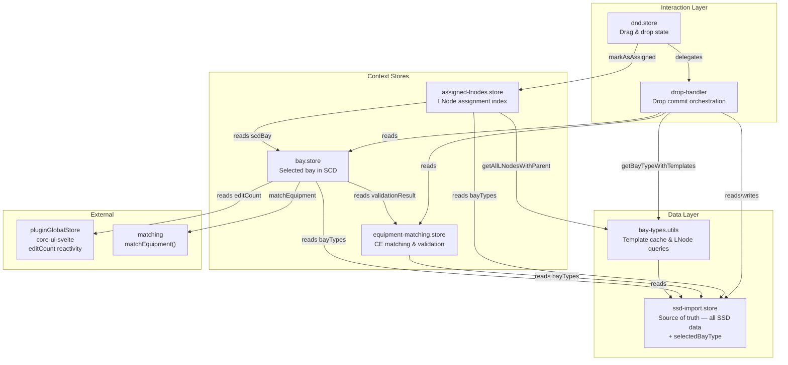

# Store Architecture

This document describes the store and utility layer in the `type-distributor` plugin — what each module owns, what it exposes, and how they relate.

## Responsibilities

| Module | Owns | Exposes |
|---|---|---|
| `ssd-import.store` | All parsed SSD data — `bayTypes`  `functionTemplates`  `conductingEquipmentTemplates` `lnodeTypes` `doTypes` `daTypes` `enumTypes` `selectedBayType` `fileInput` `currentFilename` — and the loaded document reference | `loadFromSSD()` `getConductingEquipmentTemplate()` `getFunctionTemplate()` all `$state` properties |
| `bay-types.utils` | A lazy template cache (invalidated automatically when `bayTypes` reference changes) | `getBayTypeWithTemplates(uuid)` — assembles `BayTypeWithTemplates` with Maps `getAllLNodesWithParent(bayTypeWithTemplates)` — pure LNode flattening |
| `bay.store` | `$state`: `selectedBay` `selectedBayUuid` `pendingBayTypeApply` `$derived`: `scdBay` (live DOM element) `assignedBayTypeUuid` `equipmentMatches` | `selectedBay` `selectedBayUuid` `scdBay` `assignedBayTypeUuid` `equipmentMatches` `pendingBayTypeApply` |
| `equipment-matching.store` | Conducting Equipment matching state between SCD bay and bay type template | `manualMatches` `validationResult` `templatesByType` `requiredTemplateCounts` `templateCountMismatch` `templateCountsValid` `selectedTemplateCounts` mutations: `setValidationResult()` `setMatch()` `reset()` `clearManualMatches()` |
| `assigned-lnodes.store` | Index of which LNodes have been assigned to IEDs for the current bay (`SvelteSet`) rebuild logic delegated to `assigned-lnodes.helpers.ts` | `rebuild()` `isAssigned()` `markAsAssigned()` `areAllLNodesAssigned()` `hasConnections` |
| `dnd.store` | Drag-and-drop UI state and drop execution | `isDragging` `draggedItem` `currentDraggedItem` `isDraggingItem()` `handleDragStart/End/Drop()` |
| `drop-handler` | Orchestration logic for a drop commit (not a store — plain module) | `getBayTypeApplicationState()` `shouldApplyBayType()` `applyBayType()` `buildEditsForIed()` `generateCommitTitle()` `commitEdits()` |

## Dependency Graph

## Key design decisions

- **`ssd-import.store` is the single source of truth.** All parsed SSD data — including `selectedBayType` — lives here. No other store duplicates this state. Data type templates are stored as four separate state properties (`lnodeTypes`, `doTypes`, `daTypes`, `enumTypes`) rather than a single `dataTypeTemplates` object.
- **`bay-types.utils` is a plain module, not a store.** Template assembly and LNode flattening require no reactive state beyond the cache. The cache is invalidated by reference comparison against `ssdImportStore.bayTypes`, which changes on every `loadFromSSD()` call.
- **`bay.store` exposes derived properties, not owned state, for `scdBay`, `assignedBayTypeUuid`, and `equipmentMatches`.** These are `$derived` — computed from `selectedBay`, the live SCD document, and the equipment matching store. Only `selectedBay`, `selectedBayUuid`, and `pendingBayTypeApply` are raw `$state`.
- **No circular dependencies.** Previously `ssd-import.store` called `bayTypesStore.clearCache()`, creating a cycle. This is resolved by the self-invalidating reference check in `bay-types.utils`.
- **`dnd.store` / `drop-handler` coupling is intentional.** Drop execution inherently coordinates multiple stores (bay context, matching state, assignment index). This is modelled explicitly in `drop-handler` rather than hidden inside individual stores. The single `applyBayTypeIfNeeded()` function has been split into `shouldApplyBayType()` (predicate) and `applyBayType()` (executor) for clarity.
