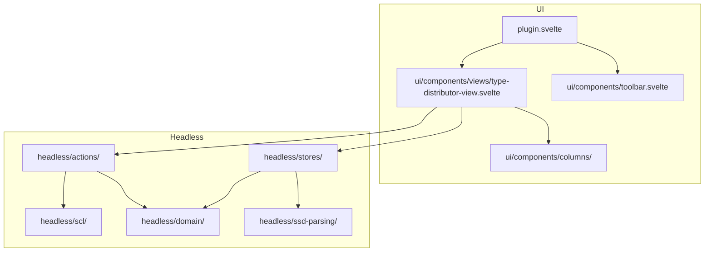

# Source overview

This document describes the current source layout for `packages/plugins/type-distributor/src`.

## Top-level structure

```text
src/
├── plugin.ts
├── plugin.svelte
├── plugin.dev.ts
├── headless/
│   ├── actions/
│   ├── common-types/
│   ├── domain/
│   ├── import/
│   ├── scl/
│   ├── ssd-parsing/
│   ├── stores/
│   ├── test-helpers/
│   └── utils/
└── ui/
    └── components/
        ├── columns/
        ├── toolbar.svelte
        └── views/
```

## Architecture diagram



## Module responsibilities

### `plugin.svelte`

The custom element entry point. It wires OpenSCD plugin props into `initPlugin`, initializes the SCD template support, and renders `Toolbar` plus `TypeDistributorView`.

### `ui/components/`

The Svelte UI layer.

- `toolbar.svelte` handles SSD import entry and bay-level controls
- `views/type-distributor-view.svelte` lays out the three columns
- `columns/bay-type/` contains bay-type selection, validation, and detail rendering
- `columns/s-ied/` contains search, create-IED/AP flows, and target access-point interactions

At the time of writing, the left `SLD` card in `type-distributor-view.svelte` is still a placeholder rather than a fully implemented domain area.

### `headless/stores/`

Reactive state and current context:

- `ssd-import.store.svelte.ts`
- `bay.store.svelte.ts`
- `equipment-matching.store.svelte.ts`
- `assigned-lnodes/`
- `dnd/`
- `bay-types.utils.ts`

These modules expose the reactive data the UI and actions consume.

### `headless/actions/`

Use-case entry points that bridge the UI and the XML-edit layer.

Important examples:

- `validate-bay-type.action.ts`
- `apply-bay-type.action.ts`
- `create-ied.action.ts`
- `create-ied-with-access-points.action.ts`
- `create-access-point.action.ts`
- delete actions for IED, access point, `LDevice`, and `LNode`

### `headless/domain/`

Pure business logic that does not own UI state.

- `matching/` contains matching and validation rules
- `type-resolution/` contains data type dependency collection

### `headless/scl/`

The SCL/XML layer:

- `queries/` for read-only XML lookups
- `filters/` for XML filtering helpers
- `elements/` for element construction helpers
- `edits/` for builders that return OpenSCD edit objects

This is the layer that turns validated user intent into concrete `Insert`, `SetAttributes`, or related edits.

### `headless/ssd-parsing/`

Parses the imported SSD into the in-memory model used by the rest of the plugin:

- bay types
- function templates
- conducting equipment templates
- data type templates

## Current boundary notes

The codebase is mostly organized around a clean UI/headless split, but a few intentional seams are worth calling out:

- `dnd.store.svelte.ts` owns drag state and also coordinates drop-time behavior through `drop-handler`
- state is store-centered rather than component-centered, so `type-distributor-view.svelte` mostly reacts to store state and action results
- the XML-edit layer is factored separately from the matching logic so the same matching result can drive multiple edit builders
