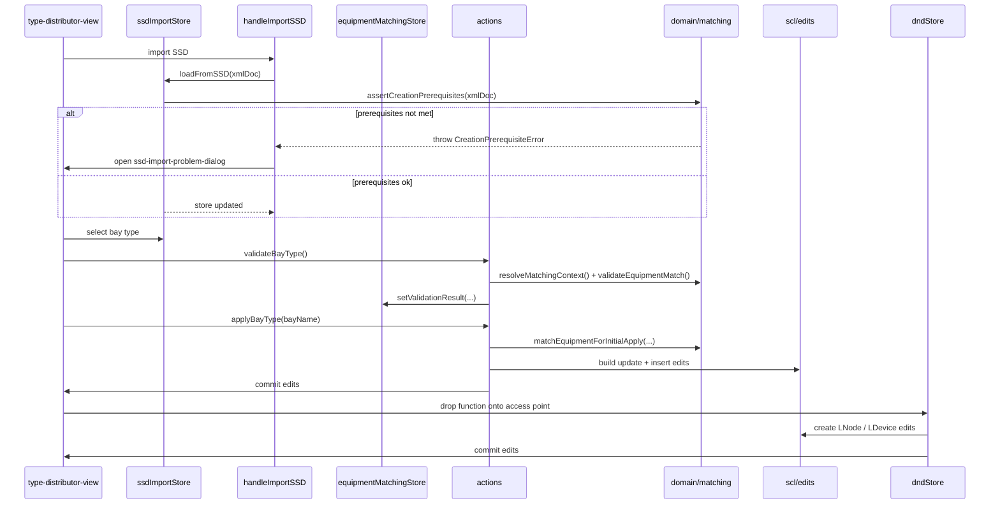

# Workflow and data flow

This document explains how the plugin moves from imported SSD data to applied SCD edits and finally to assigned `S-IED` content.

## End-to-end workflow

```mermaid
flowchart LR
    SSD["Import SSD"]
    Parse["ssd-parsing/"]
    Store["ssdImportStore"]
    Select["Select bay + bay type"]
    Validate["validateBayType()"]
    Manual["Manual matching when required"]
    Apply["applyBayType()"]
    Edits["SCL edit builders"]
    Dnd["Drag Function / EqFunction to S-IED"]
    Assign["Create LDevices and update Bay LNodes"]

    SSD --> Parse --> Store
    Store --> Select --> Validate
    Validate --> Manual
    Validate --> Apply
    Manual --> Apply
    Apply --> Edits --> Dnd --> Assign
```

## Key runtime path

### 1. Import SSD

`handleImportSSD()` (in `ui/components/ssd-validation/`) calls `loadFromLocal()`, which:

1. reads the selected file and parses it as XML
2. throws `INVALID_XML_IMPORT_MESSAGE` if the file is not valid XML
3. calls `ssdImportStore.loadFromSSD(...)`, which runs `assertCreationPrerequisites(xmlDocument)` before committing any state

`assertCreationPrerequisites` verifies that the SSD contains:
- an `LNodeType` with `lnClass="LLN0"`
- all four mandatory DOs: `NamPlt`, `Beh`, `Health`, `Mod`

If any check fails a `CreationPrerequisiteError` is thrown, `loadFromSSD` resets the store to its empty state, and `handleImportSSD` catches the error and opens `ssd-import-problem-dialog.svelte` via `dialogStore` to surface the problem to the user without loading partial data.

When the import succeeds, `ssdImportStore` stores:

- bay types
- function templates
- conducting equipment templates
- `LNodeType`, `DOType`, `DAType`, and `EnumType`

This store becomes the source of truth for the imported template side of the plugin.

### 2. Select bay and bay type

`type-distributor-view.svelte` derives the active bay type from:

- `bayStore.assignedBayTypeUuid` for already-applied bays
- `ssdImportStore.selectedBayType` for current selection

It then resolves assembled templates through `getBayTypeWithTemplates(...)`.

### 3. Validate before apply

`validateBayType()` resolves the current matching context and writes the result to `equipmentMatchingStore`.

Validation covers:

- bay-type changes blocked by existing LNode connections
- conducting-equipment type count mismatches
- ambiguous matches that require explicit user choices

### 4. Resolve equipment matching

When the user applies a bay type, `applyBayType(...)` calls `matchEquipmentForInitialApply(...)`.

That path:

1. reuses persisted `templateUuid` mappings when possible
2. applies manual matches from `equipmentMatchingStore.manualMatches`
3. falls back to type-based matching for the remaining equipment

Persisted bays use `matchEquipmentForPersistedBay(...)` instead.

### 5. Build and commit SCL edits

`applyBayType(...)` gathers edits from the SCL layer:

- `buildUpdateForBay(...)`
- `buildEditsForEquipmentUpdates(...)`
- `buildInsertsForEqFunction(...)`
- `buildInsertsForFunction(...)`
- `ensureDataTypeTemplates(...)`
- `buildInsertsForDataTypeTemplates(...)`

These edits are committed in one transaction through the OpenSCD editor.

### 6. Drag and drop into S-IEDs

`dndStore.handleDrop(...)` coordinates the assignment workflow:

- it checks whether the bay type must be applied first
- it resolves the right function UUID for bay-level and equipment-level functions
- it creates the required `LDevice` and `LNode` edits
- it updates the bay-side `LNode` connections when needed
- it marks the assigned content in `assignedLNodesStore`

## Interaction diagram

## Why this split matters

The workflow deliberately separates three concerns:

- stores keep the current working state reactive
- domain logic decides what should happen
- the SCL layer decides how that intent becomes XML edits

That separation is what makes the README, ADRs, and concept docs useful: each document can describe one stable layer instead of mixing workflow, state ownership, and edit-building details into a single file.
