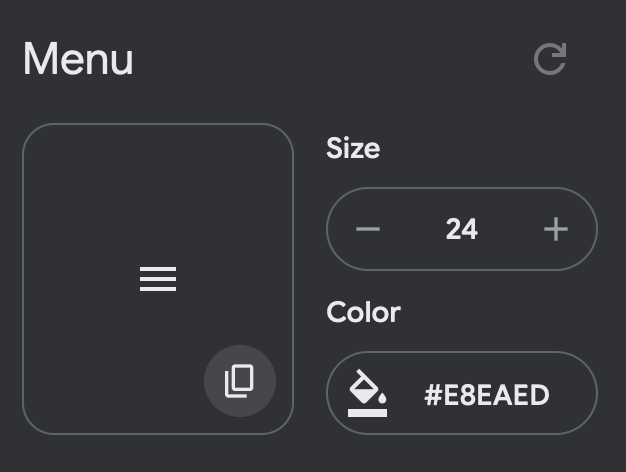
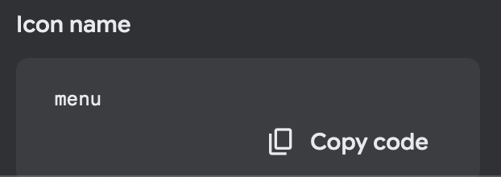

# ICONS

## To add a new icon :

* Go to `https://fonts.google.com/icons`
* Choose your icon, click on it and copy the icon by clicking on the copy icon within the icon (size and color will be set with css):

* Extract the part from the `d` attribute of the svg and add it in `icons-draw.ts`

* Key name should be the name of the icon (here `menu`). It can be found and copied at the end of the drawer.

